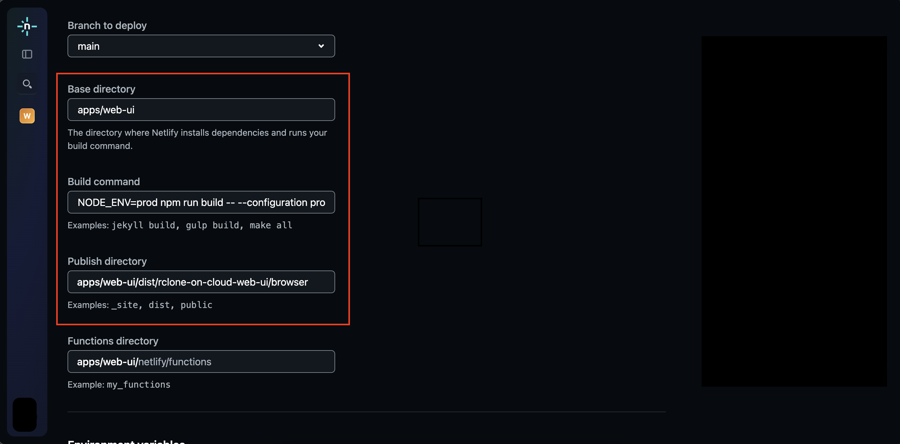
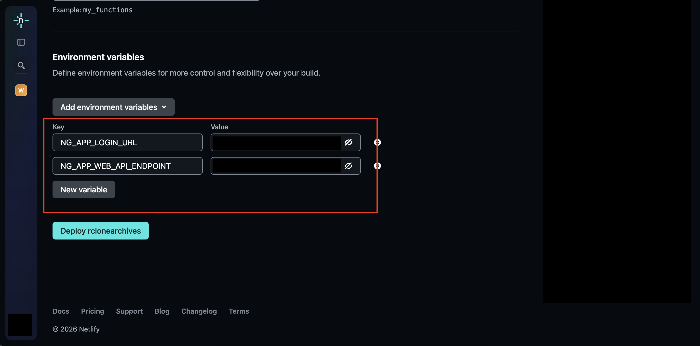

# Deploying to Netlify

To deploy the app to Netlify, you need to first set:

1. Branch to main
2. Base directory to `apps/web-ui`
3. Build command to `NODE_ENV=prod npm run build -- --configuration production`
4. Publish directory to `apps/web-ui/dist/rclone-on-cloud-web-ui/browser`

Then, add the following environment variables:

- NG_APP_LOGIN_URL: The login url to the web api (ex: <http://localhost:3000/auth/v1/google>)
- NG_APP_WEB_API_ENDPOINT: The endpoint to the web api (ex: <http://localhost:3000>)

